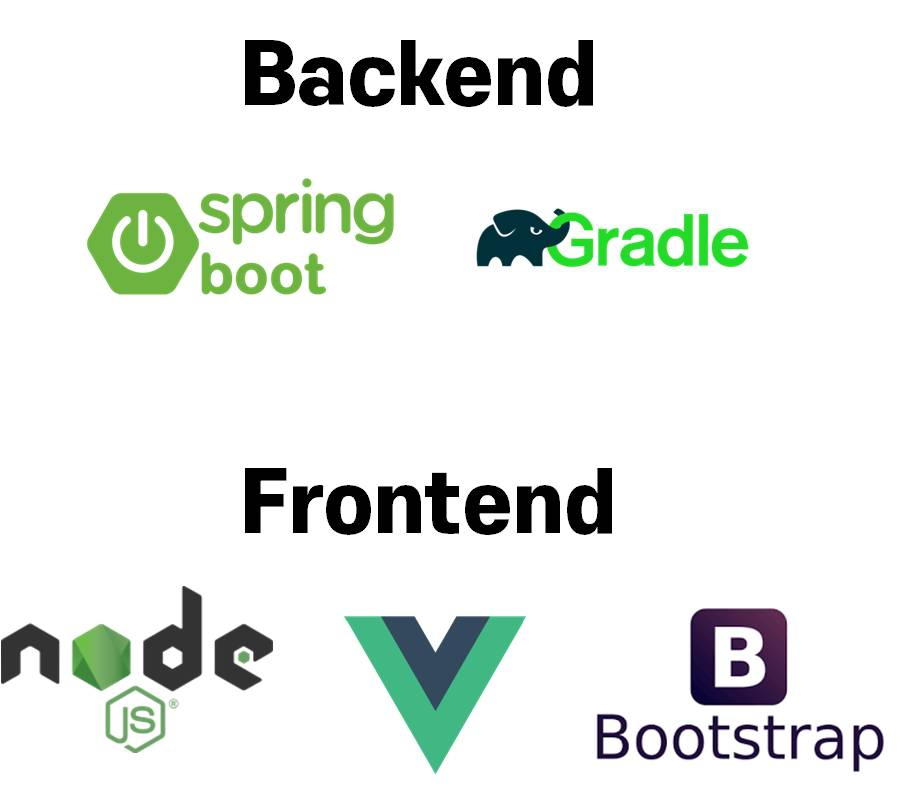
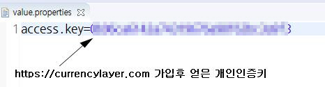
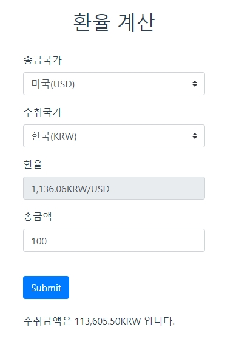

# wirebarleyFrontAndBack

## 개발환경설명

<h3>
Backend:  
langage: java, SQL 
Application FrameWork: SpringBoot 
Build-Tool: Gradle  
Dependencies: Web, JPA, H2 database, Lombok 
WAS:apache tomcat 
 
Frontend: 
langage: Javascript, HIML, CSS 
Javascript Freamework: Vue., Bootstrap-Vue 
lib: axios 
WebServer: NodeJS 
</h3>
 

## 프로젝트 구조
프로젝트 구조에 대해서 각 폴더 내 Wiki에서 설명합니다.

## 실행을 위한 개발환경 조건
1. java 설치 및 환경설정
2. gradle 설치 및 환경설정
3. node js 설치

## 서버 실행 순서
1. Backend
2. Frontend

## Backend 서버 실행

<h3>Backend 폴더 내부로 이동</h3>
<pre><code>$ cd Backend</code></pre>
 

### Gradle Build

<h3>Build 하기전 주의 사항</h3>
<h4>value.properties 파일 없이 build시 오류가 발생합니다</h4>

1. src / main / resource 폴더 아래 config 폴더 생성합니다.
2. config / value.properties 파일을 생성합니다
3. https://currencylayer.com/ 접근에 필요한 개인인증키를 입력합니다.(회원가입후 얻을수 있습니다.)
4. 아래와 같은 방식으로 입력합니다

<pre><code>access.key={개인인증키 입력}</code></pre>

#### OS 별 명령어
<h4>Mac</h4>
<pre><code>$ gradle build</code></pre>
 
<h4>Windows</h4>
<pre><code>$ gradlew.bat build</code></pre>

### 서버실행
build가 성공적으로 마치게 되면 build/libs/spring-boot-0.0.1-SNAPSHOT.jar
파일이 생성됩니다. 해당 위치에서 cmd를 열고 아래 명령어를 입력합니다.
<pre><code>$ java -jar spring-boot-0.0.1-SNAPSHOT.jar</code></pre>
 
## Frontend 서버 실행
<h3>Frontend 폴더 내부로 이동</h3>
<pre><code>$ cd Frontend/frontServer</code></pre>
 

### 프로젝트 build
<pre><code>$ npm install</code></pre>

### Front 서버 실행
<pre><code>$ npm run dev</code></pre>

## 브라우저 접속
http://localhost:8080/index.html

## 결과

<h3>예외사항: 호주 환율은 지원하지 않습니다.</h3
  
currencylayer.com API에서 지원하지 않습니다
